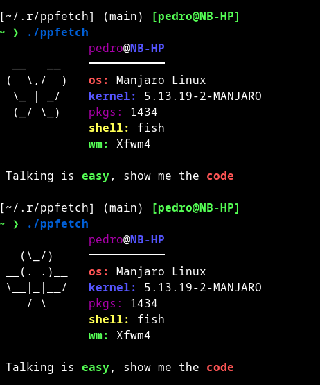

<h1 align="center">ppfetch - Info script written in Shell Script.</h1>

 

## What's ppfetch?
The ppfetch was created to be a simple, basic, and posix fetch, you don't need a config file to customize ppfetch, or a handbook to use it. It's in your principle, it still has a long way to go to make it the friendly fetch I want it to become. It's a libre software, write your changes, make it your, or make a pull request and become a contributor to the project. You can create issues to contribute to the project too.



## How to install ppfetch
If you are a user of Arch Linux based, can install ppfetch with a AUR helper such yay:
```
yay -Sy ppfetch-git
```

If you're a Gentoo user, to install ppfetch, add the [GentooBR Overlay](https://github.com/gentoobr/overlay), and then run the following command:
```
emerge -av '=app-misc/ppfetch-9999'
```
you will also need to unmask the package.

To install ppfetch in another distro, download the installer script:
```sh
curl https://raw.githubusercontent.com/pedroportales/ppfetch/main/install.sh | sh
```
Thanks for use ppfetch!
